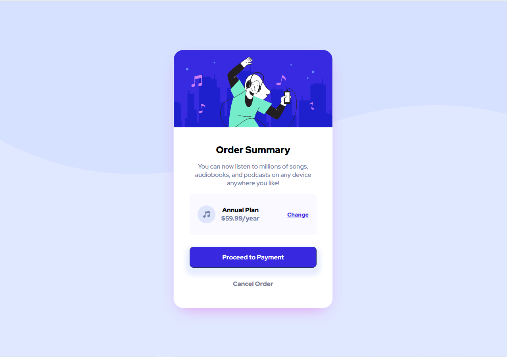
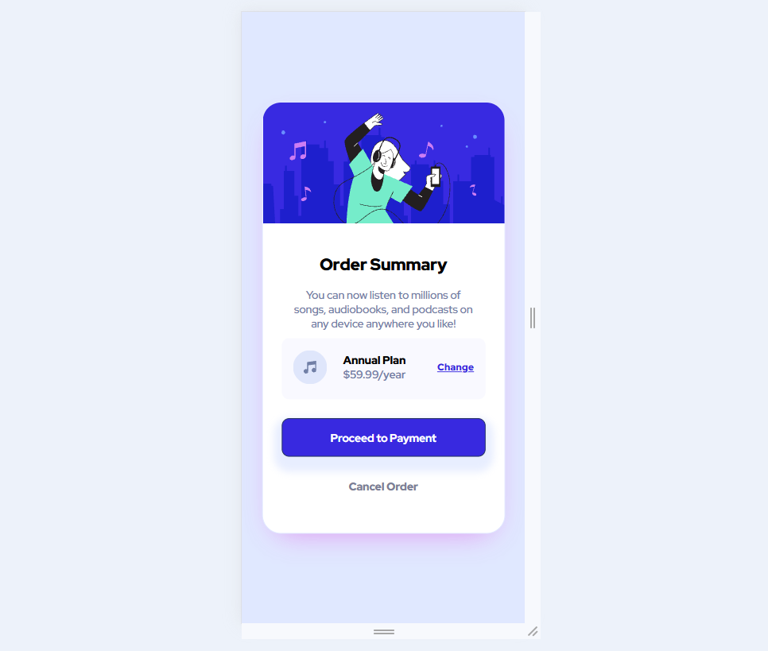

# Frontend Mentor - Order summary card solution

This is a solution to the [Order summary card challenge on Frontend Mentor](https://www.frontendmentor.io/challenges/order-summary-component-QlPmajDUj). Frontend Mentor challenges help you improve your coding skills by building realistic projects. 

## Table of contents

- [Overview](#overview)
  - [The challenge](#the-challenge)
  - [Screenshot](#screenshot)
  - [Links](#links)
- [My process](#my-process)
  - [Built with](#built-with)
  - [What I learned](#what-i-learned)
  - [Continued development](#continued-development)
  - [Useful resources](#useful-resources)
- [Author](#author)
- [Acknowledgments](#acknowledgments)

## Overview

### The challenge

Users should be able to:

- See hover states for interactive elements

### Screenshot

## My process

### Built with

- Semantic HTML5 markup
- CSS custom properties
- Flexbox

### What I learned

I could practise how I can use HTML and CSS to project webpage. The information from IT course I tested. In this particular project I found out in what way I can apply one background on the another one.

### Continued development

I will be trying to use the semantic tags during whole creating future projects process. For this one I had to rebuild the project after creating it only on divs.

### Useful resources

- https://miroslawzelent.pl/kurs-html/
- https://miroslawzelent.pl/kurs-css/
- https://digitalportal.pl/box-shadow-generator - It helped in showing previews of some shadows settings

## Author

- github - [Łukasz Nowak](https://github.com/lukasz-nowak44)

## Acknowledgments

Artur and team from https://projekt.przyszlyprogramista.pl/
